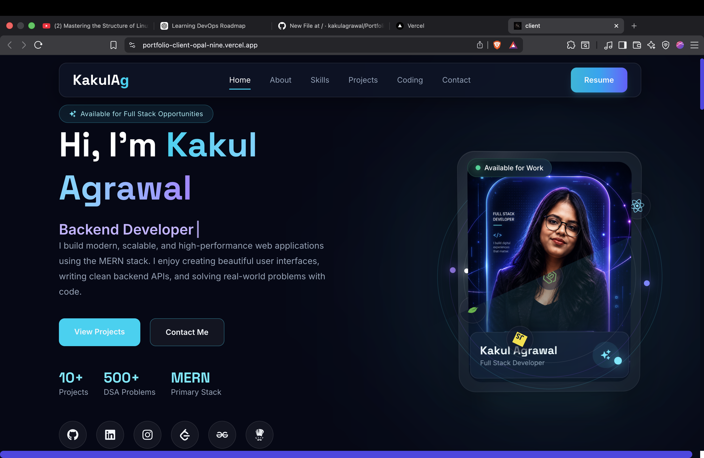
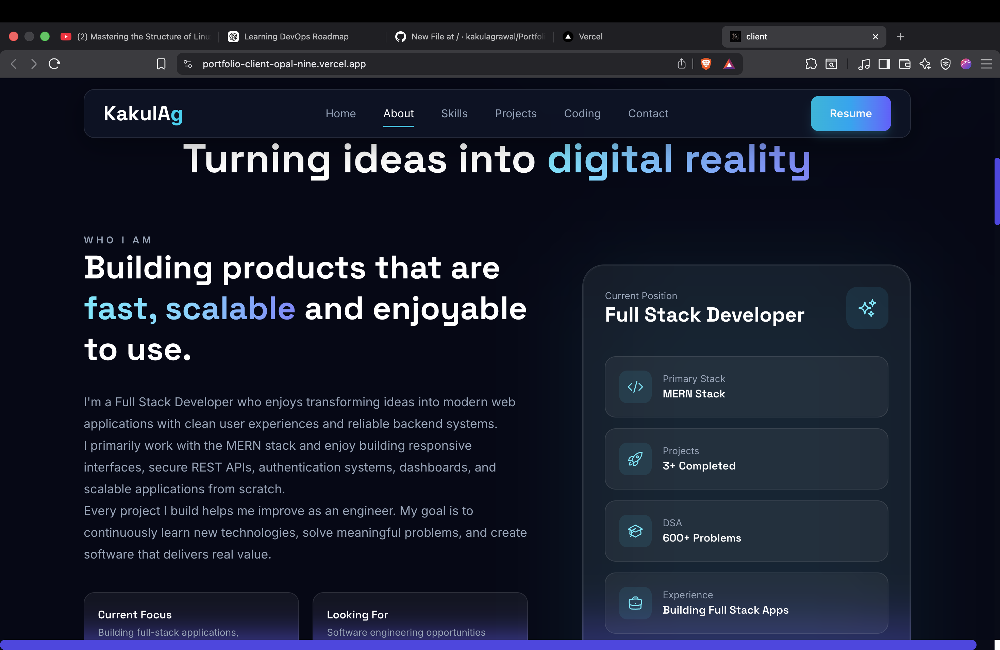
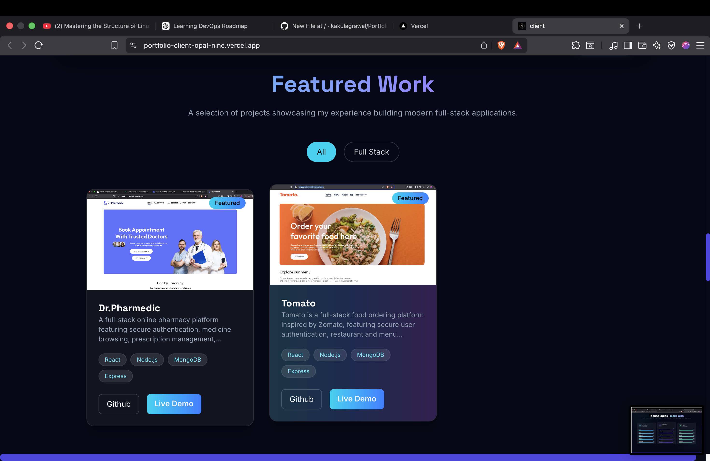
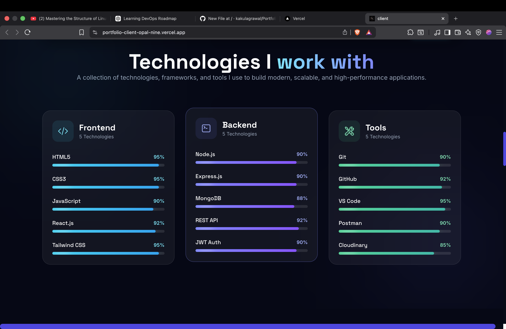
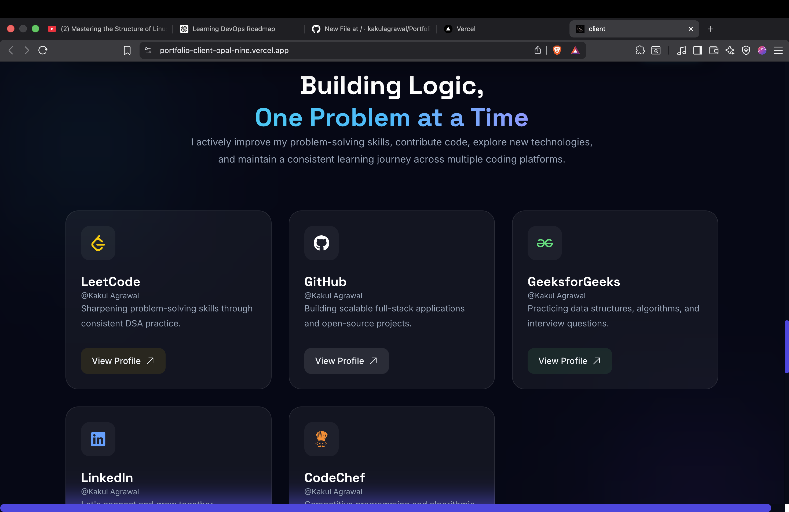
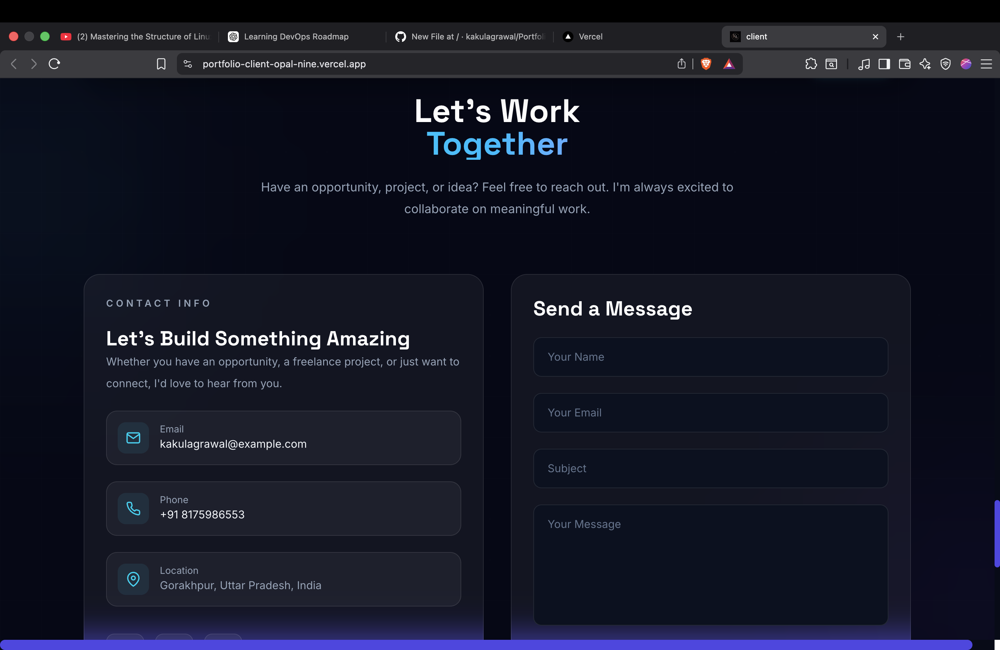

# 🚀 Kakul Agrawal - Portfolio Website

A modern, responsive, and animated developer portfolio built to showcase my projects, skills, and experience. 
The website features a clean UI, smooth animations, and a custom admin dashboard (CMS) that allows me to manage portfolio projects without modifying the code.

## 🌐 Live Website

👉 **Visit Here:** https://portfolio-client-opal-nine.vercel.app/

## 📸 Screenshots

### Home


### About


### Projects


### Skills


### Coding Profiles


### Contact



## ✨ Features

* 🎨 Modern and responsive UI
* ⚡ Smooth animations with Framer Motion & GSAP
* 📱 Mobile-friendly design
* 🛠️ Portfolio CMS for managing projects
* 🔒 Secure admin authentication
* ☁️ Cloudinary image upload support
* 🌐 Dynamic project data fetched from the backend
* 📬 Contact section
* 🚀 Fast performance with Vite

## 🛠️ Tech Stack

### Frontend

* React
* Vite
* Tailwind CSS
* Framer Motion
* GSAP
* Axios
* React Router DOM

### Backend (Portfolio CMS)

* Node.js
* Express.js
* MongoDB
* Mongoose
* JWT Authentication
* Cloudinary
* Multer

## 📂 Project Structure

```text
Portfolio
├── client
│   ├── src
│   ├── public
│   └── package.json
│
├── admin
│   ├── src
│   └── package.json
│
└── server
    ├── controllers
    ├── models
    ├── routes
    ├── middleware
    ├── config
    └── package.json
```

## 🚀 Getting Started

### 1. Clone the Repository

```bash
git clone <repository-url>
cd portfolio
```

### 2. Install Dependencies

#### Client

```bash
cd client
npm install
```

#### Admin

```bash
cd ../admin
npm install
```

#### Server

```bash
cd ../server
npm install
```

### 3. Configure Environment Variables

Create a `.env` file inside the `server` directory and add the required environment variables:

```env
PORT=8000

MONGODB_URI=YOUR_MONGODB_URI

JWT_SECRET=YOUR_SECRET_KEY

CLOUDINARY_CLOUD_NAME=YOUR_CLOUD_NAME
CLOUDINARY_API_KEY=YOUR_API_KEY
CLOUDINARY_API_SECRET=YOUR_API_SECRET

CLIENT_URL=http://localhost:5173
ADMIN_URL=http://localhost:5174
```

## ▶️ Run the Application

### Start Backend

```bash
cd server
npm run dev
```

### Start Portfolio Website

```bash
cd client
npm run dev
```

### Start Admin Dashboard

```bash
cd admin
npm run dev
```

## 📸 Screenshots

*Add screenshots of your portfolio here.*

## 🌟 Future Improvements

* Blog section
* Dark/Light theme toggle
* Visitor analytics
* Project filtering
* Downloadable resume
* DevOps deployment with Docker & AWS
* CI/CD using GitHub Actions

## 👨‍💻 Author

**Kakul Agrawal**

Passionate Full Stack Developer focused on building scalable web applications and continuously learning new technologies.

## ⭐ Support

If you like this project, consider giving it a ⭐ on GitHub!
